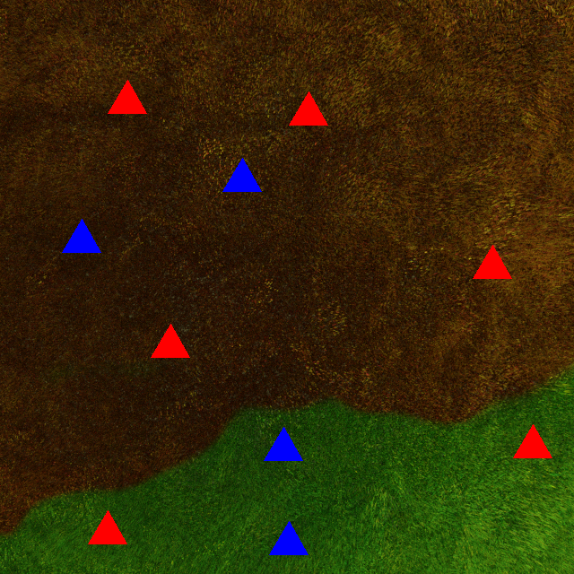
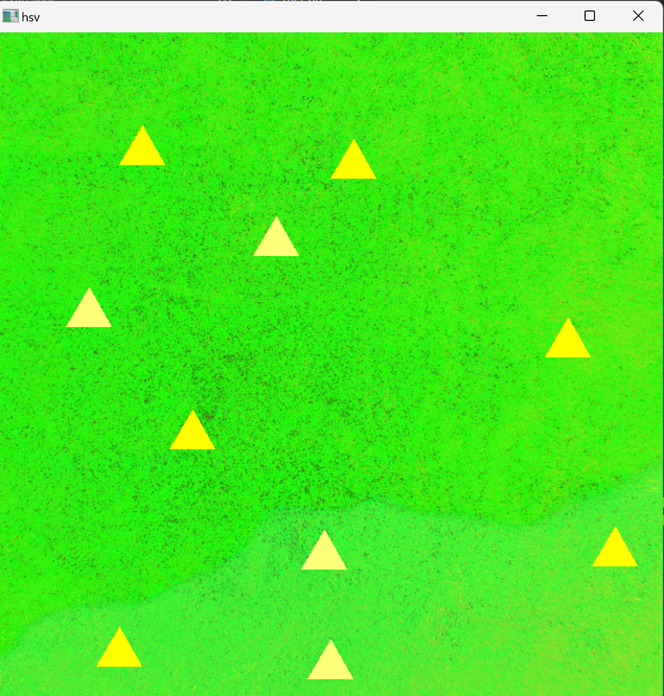
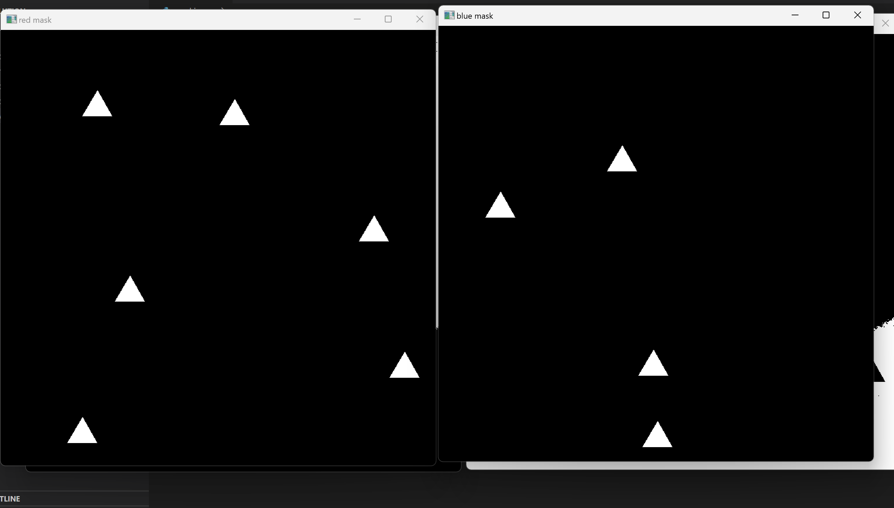
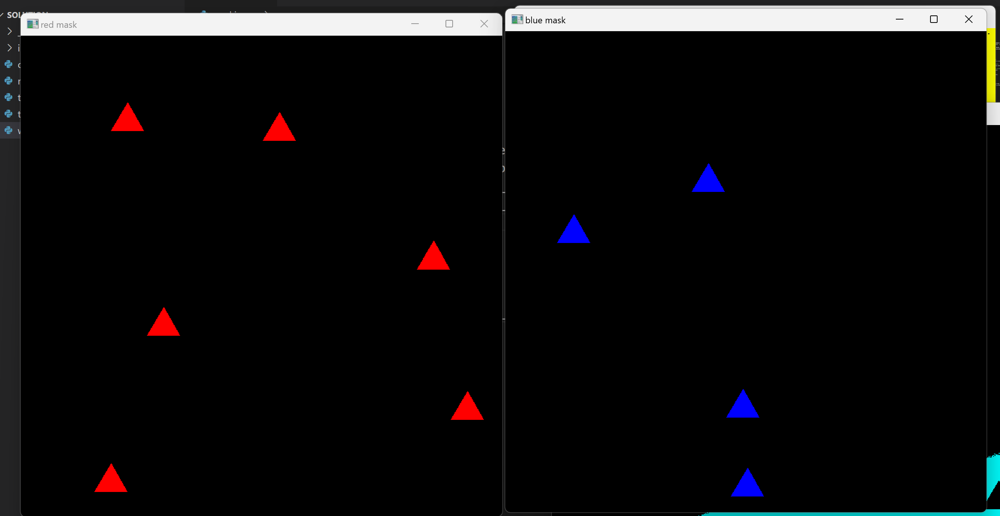
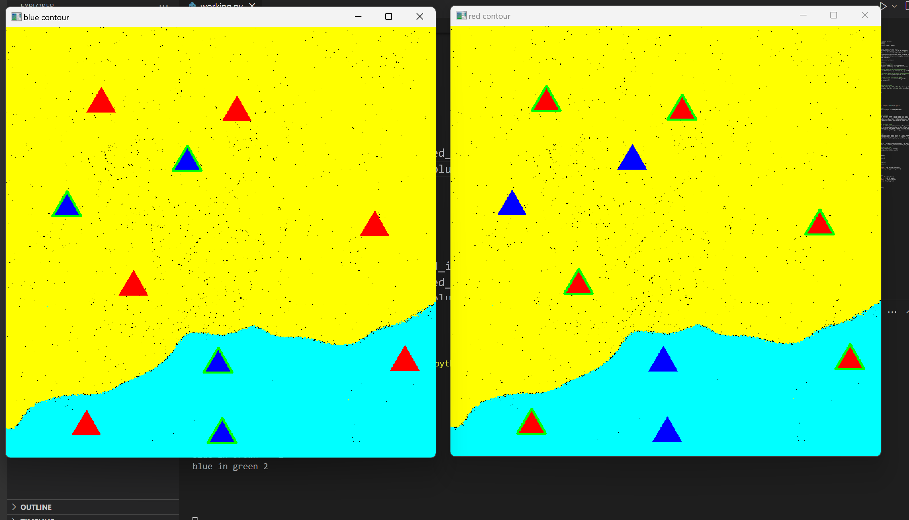

## UAS DTU Round 2 task

How i approached the task, 

 1. Read the image.                                                     
 2. Converted the image to hsv.                       
 3. Created different masks for different colours.
 4. Used blue colour overlay to depict green part, and yellow colour overlay to depict brown part.                                
 5. Next, i used contours to identify the pointers in masked images.
6. Now i found the surrounding colours using the dilute function of cv and found the mean of the values.
7. Then i compared the values of these surrounding pixels and updated the different numbers.