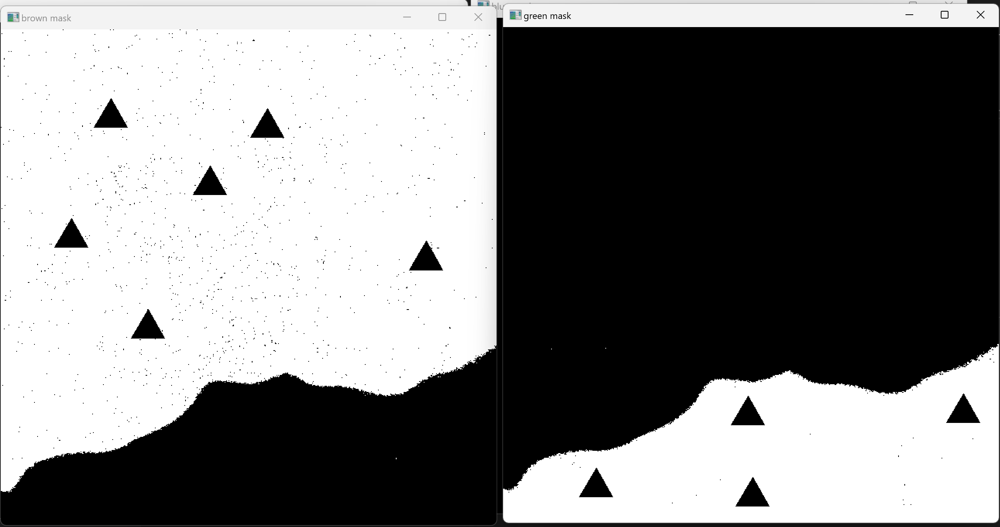
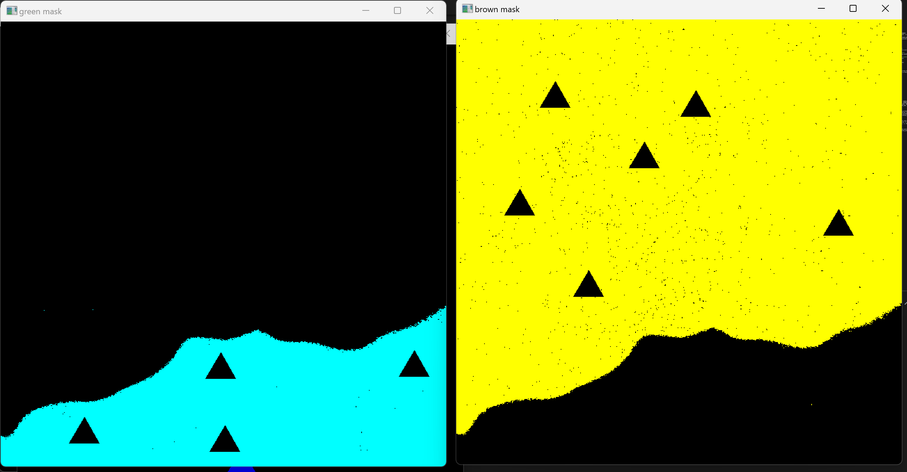

## UAS DTU Round 2 task

 The folders in the repository are:-

 - logbook:- contains the work i did on a specific date
 - solution:- contains the code for the task given
 - practise-code:- the code i wrote while learning the libraries

How i approached the task, 

 1. Read the image.<br/>                                                   
 2. Converted the image to hsv.<br/>                       
 3. Created different masks for different colours.<br/>
 4. Used blue colour overlay to depict green part, and yellow colour overlay to depict brown part. <br/>                               
 5. Next, i used contours to identify the pointers in masked images.<br/>
6. Now i found the surrounding colours using the dilute function of cv and found the mean of the values.<br/>
7. Then i compared the values of these surrounding pixels and updated the different numbers.<br/><br/><br/>

The output of the program is formatted as:
```
the house list :  [[6, 4], [5, 4], [8, 6], [3, 4], [6, 3], [6, 4], [2, 6], [7, 5], [6, 4], [6, 4]]
the priority_list :  [[8, 6], [8, 6], [12, 10], [4, 7], [9, 4], [10, 5], [3, 10], [10, 8], [8, 5], [8, 6]]
the pr list in ascending order :  [ 5  6  9 10  2  1  8  3  4  7]

``` 
the requested lists are, "houses_list, priority_list, pr_list"